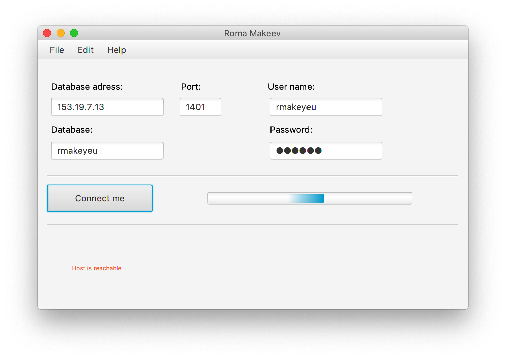
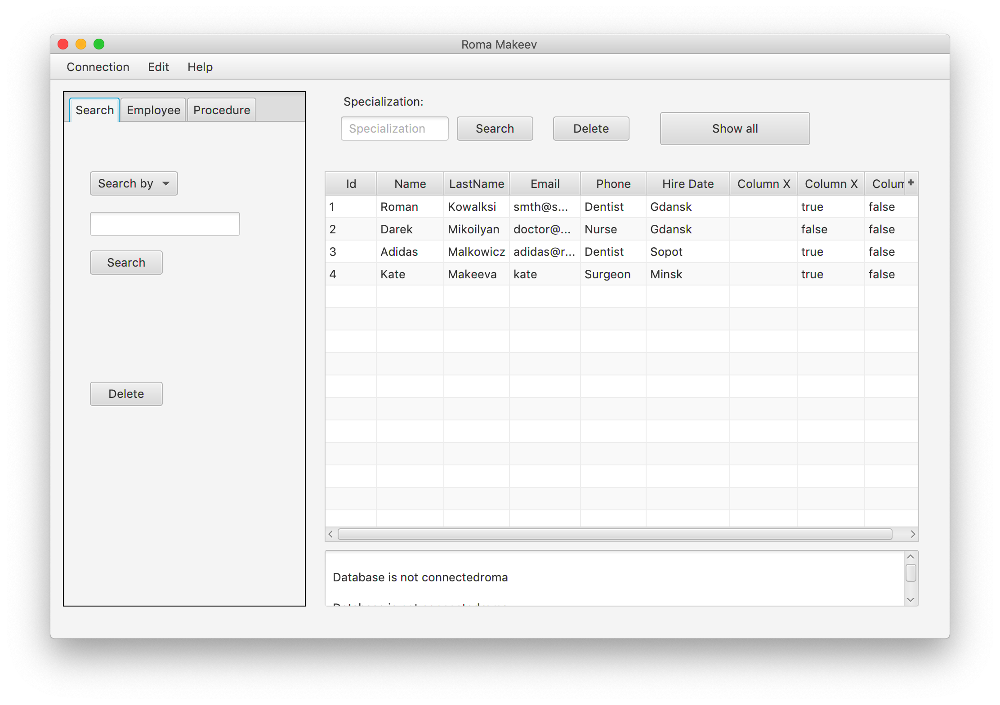
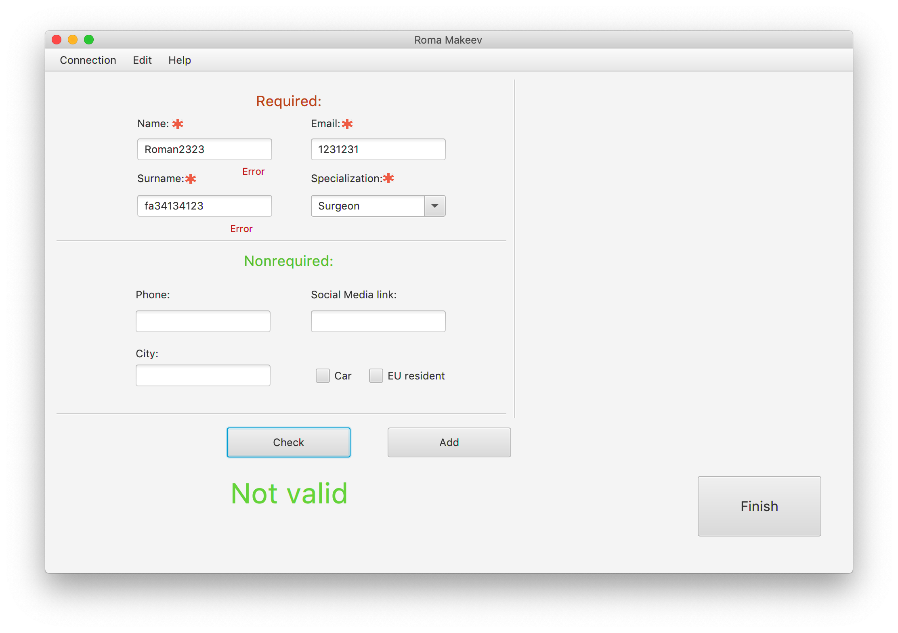
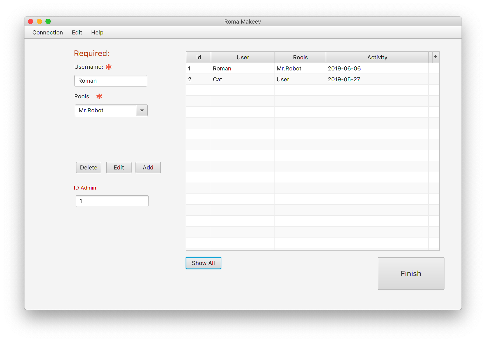
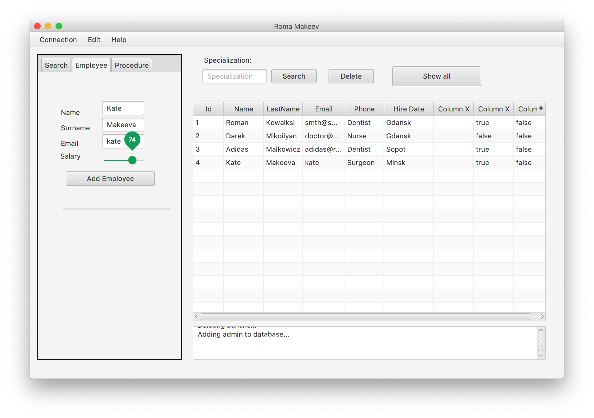
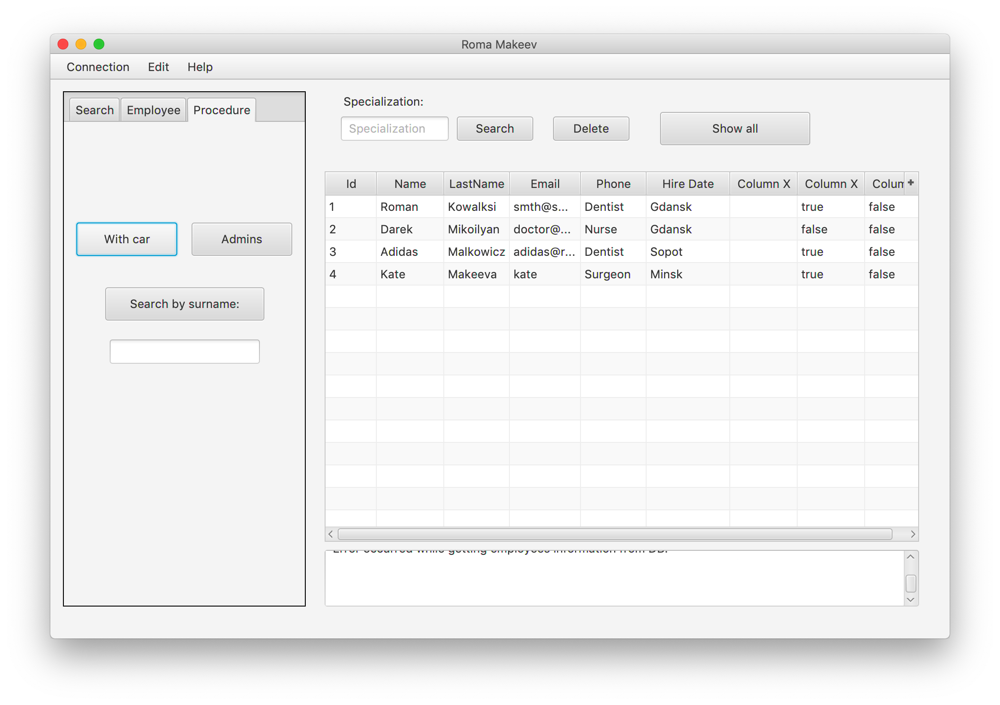

# Log in form


```bash
Password: github
```

## Connection:


Checking server by ping
```bash
ping to @input server
if (true) 
 connect
```

## Main window:


## Adding form:


## Admins Panel:


## Employee Panel:


## Procedure Panel:



